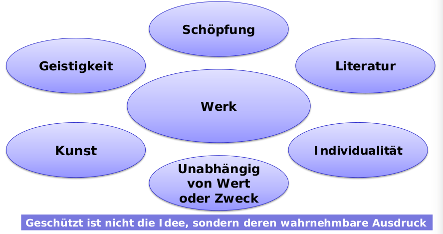
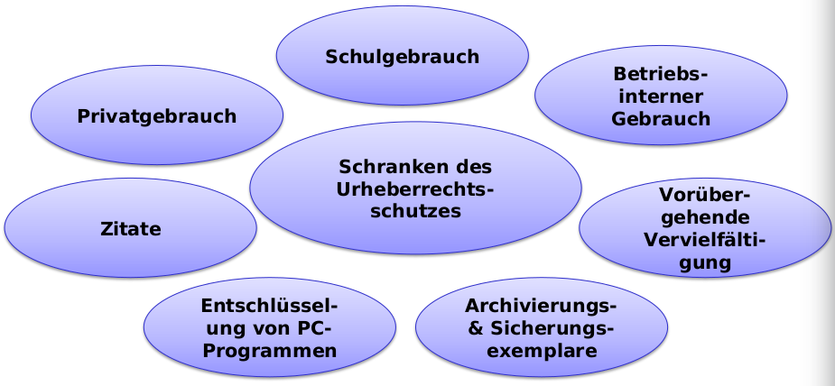

# Grundzüge des Urheberrechts

## Immaterialgüterrecht (Geistiges Eigentum)

Schutz vor ungreifbaren Gütern.
- Urheberrechte
- Designrechte
- Patentrechte
- Markenrechte

## Schutzvoraussetzungen

1. Literarische, wissenschaftliche und andere Sprachwerke
1. Werke der Musik und der bildenden Kunst
1. Werke mit wissenschagtlichen oder technischem Inhalt
1. Computerprogramme
1. Werke der Baukunst
1. Fotographische, filmische oder visuelle Werke.

__Sonderfall: Werke zweiter Hand__  
Schöpfungen mit individuellem Charakter, die unter Verwendung bestehender Werke so geschaffen werden, dass die verwendeten Werke in ihrem individuelle Charakter erkennbar bleiben.

## Urheberschaft - Miturheberschaft

__Urheber__ ist die __natürliche Person__, die das Werk geschaffen hat (Art. 6 URG) --> __Schöpferprinzip__. 

Eine __Miturheberschaft__ liegt vor, wenn mehrere Personen gemeinsam, d.h. in __bewusster Zusammenarbeit__ und nach einem __gemeinsamen Konzept__, ein Werk schaffen. Dabei steht das Urheberrecht allen gemeinsam zu (__Zustimmung aller Miturheber nötig!__)

## Abhängige Werkschöpfung
Auch wenn ein Werk __im Rahmen eines Abhängigkeitsverhältnisses__ geschaffen wird, erwirbt der __Schöpfer originär__ das __Urheberrecht__. Nur für __Computerprogramme__ kennt das URG eine entsprechende Norm (Art. 17 URG).  Diese gilt aber auch __nur__ für den __Arbeitsvertrag__ und nicht für Auftrags- und Werkvertragsverhältnisse.

Arbeitgeber sollte sich im Arbeitsvertrag sämtliche Urheberrechte abtreten zu lassen.

## Urheberrechte

### Urherberpersönlichkeitsrechte
__Können nicht übertragen werden!__

- Recht auf Erstveröffentlichungen
- Recht auf Anerkennung der Urheberschaft
- Recht auf Werkintegrität

### Verwendungsrechte
__Können übertragen werden! (e.g. im Arbeitsvertrag)__
- Vervielfältigungsrecht
- Verbreitungsrecht
- Recht auf öffentliche Wahrnehmbarmachung
- Senderechte
- Weitersenderechte
- Vermieten von Computerprogrammen
- Bearbeitungsrecht

## Schutzvoraussetzungen und –dauer
Der urheberrechtliche Schutz beginnt __ohne irgendeine Anmeldung__ in dem Moment, in dem ein Werk die  Schutzvoraussetzungen erfüllt, d.h. sobald die Grenze der Individualität überschritten wird (auch Entwürfe sind geschützt).

Schutzdauer __70 Jahre nach dem Tod__ des Urhebers (__50 Jahre__ bei __PC-Programmen__). Wenn mehrere Urheber vorhanden sind, dann beginnt diese Zeit, wenn der letzte ins Grad beisst. 

## Schranken des Urheberrechtsschutzes

## Rechtsübergang und Rechte an Programmen

- Die Verwendungsrechte an einem Werk sind unter Lebenden oder __von Todes wegen__ vollständig auf Dritte __übertragbar__
- Die Urheberpersönlichkeitsrechte sind unter Lebenden nicht übertragbar, von Todes wegen gehen sie jedoch auf die Erben über
- Als einzige können Computerprogramme als Dienstwerke geschaffen werden, sofern der Urheber in einem Arbeitsverhältnis steht und dieses zu diesem Zweck (d.h. Schaffung von Computerprogrammen) besteht

## Rechtsschutz

__Zivilrechtlicher Schutz__ für Schadenersatz und Genugtuung gilt das Obligationenrecht. 

__Strafrechtlicher Schutz__ gilt bei gewerblicher Missachtung des Urheberrechts. In diesem Fall gibt es Gefängnisstrafen bis zu 3 Jahren.