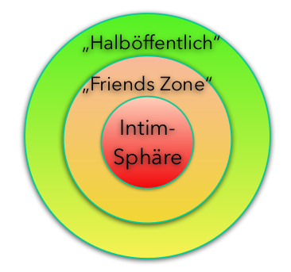

# Privacy & Datenschutz

## Weshalb Privacy und Datenschutz
Privatsphäre ist ein Menschenrecht. Alle modernen Demokratien schützen diese! Im Grundsatz..

Um einen liberalen Lebensstil zu wahren, muss jeder Bürger selbst entscheiden können __welche__ Informationen er zur Verfügung stellt und __wie__ diese benutzt werden dürfen.

## Sphärentheorie

Jeder entscheidet selbst, welche Daten/Information in welcher Sphäre ist, weil jeder steht dazu was er macht. 

__Persönlichkeitsverletzung__: Wenn Daten/Informationen von einer Drittperson weitergegeben werden und somit ein Sphärenübertritt stattfindet, spricht man von einer Persönlichkeitsverletzung.

## Schutz der Persönlichkeit 
    Wer in seiner Persönlichkeit widerrechtlich verletzt wird, kann zu seinem Schutz gegen jeden, der in der Verletzung mitwirkt, das Gericht  anrufen.

__Sehr wichtig:__

    Eine Verletzung ist widerrechtlich, wenn sie nicht durch Einwilligung des Verletzten, durch ein überwiegend privates oder öffentliches Interessen oder durch Gesetz gerechtfertigt ist.

Dieses Gesetz stammt nicht vom Datenschutzgesetz, sondern vom Zivilgesetzbuch.

Öffentliches Intresse besagt nicht, was die Öffentlichkeit __interessiert__ sondern was für die Öffentlichkeit __relevant__ ist.

## Datenschutz
Als Datenschutz versteht man der Schutz der __Integrität__ einer Person vor Verletzungen Dritte.

Datenschutz ist...

- Schutz der __informationellen Sebstbestimmung__
- Schutz der Persönlichkeit bei der Datenverarbeitung
- Schutz der Privatsphäre
- Schutz vor missbräuchlicher Datenverbreitung

## Gesetzliche Grundlagen
- Schweizerische Bundesverfassung
- Bundesgesetz über den Datenschutz (DSG) und Verordnung dazu (VDSG) 
- Zahlreiche datenschutzrechtliche Bestimmungen in anderen Gesetzen
- Kantonales und Gemeinderecht: zahlreiche Gesetze und Verordnungen 
- International: Europäische Datenschutzrichtlinie bzw. -Grundverordnung (DSGVO/GDPR)

## Geltungsbereich des Datenschutzgesetzes
Dieses Gesetz gilt für das Bearbeiten von Daten __natürlicher und juristischer Personen__ durch a. private Personen und b. Bundesorgane.

Es ist nicht anwendbar auf: 
- Personendaten, die eine __natürliche Person ausschliesslich zum persönlichen Gebrauch bearbeitet und  nicht an Aussenstehende bekannt gibt__ 
- Beratungen in den Eidgenössischen Räten und in den parlamentarischen Kommissionen 
- __hängige Zivilprozesse, Strafverfahren__, Verfahren der internationalen Rechtshilfe sowie staats- und verwaltungsrechtliche Verfahren mit Ausnahme erstinstanzlicher Verwaltungsverfahren
- öffentliche Register des Privatrechtsverkehrs
- Personendaten, die das Internationale Komitee vom Roten Kreuz bearbeitet.

### BEGRIFFE & DEFINITIONEN
__Personendaten__
 (Daten): alle Angaben, die sich auf eine bestimmte oder bestimmbare Person beziehen.   
  __betroffene Personen__: natürliche oder juristische Personen, über die Daten bearbeitet werden  
  __besonders schützenswerte Personendaten Daten__ über_  
  1. die religiösen, weltanschaulichen, politischen oder gewerkschaftlichen Ansichten oder Tätigkeiten
  42. die Gesundheit, die Intimsphäre oder die Rassenzugehörigkeit,
  42. Massnahmen der sozialen Hilfe,
  42. Massnahmen der sozialen Hilfe,

__Persönlichkeitsprofil__: Eine Zusammenstellung von Daten, die eine Beurteilung wesentlicher Aspekte der  
Persönlichkeit einer natürlichen Person erlaubt

__Bearbeiten__: jeder Umgang mit Personendaten, unabhängig von den angewandten Mitteln und Verfahren, insbesondere das Beschaffen, Aufbewahren, Verwenden, Umarbeiten, Bekanntgeben, Archivieren oder Vernichten von Daten.

__Bekanntgeben__: das Zugänglichmachen von Personendaten wie das Einsichtgewähren, Weitergeben oder Veröffentlichen.

__Datensammlung__: jeder Bestand von Personendaten, der so aufgebaut ist, dass die Daten nach betroffenen Personen erschliessbar sind.

__Bundesorgane__: Behörden und Dienststellen des Bundes sowie Personen, soweit sie mit öffentlichen Aufgaben des Bundes betraut sind.

__Inhaber der Datensammlung__: private Personen oder Bundesorgane, die über den Zweck und den Inhalt der Datensammlung entscheiden.

### DATENSCHUTZGRUNDSÄTZE
1. Personendaten dürfen nur __rechtmässig__ bearbeitet werden. 
42. Ihre Bearbeitung hat nach Treu und Glauben zu jerfolgen und muss __verhältnismässig__ sein. 
42. Personendaten dürfen __nur zu dem Zweck bearbeitet werden, der bei der Beschaffung angegeben wurde, aus den Umständen ersichtlich oder gesetzlich vorgesehen ist.__
42. Die Beschaffung von Personendaten und insbesondere der Zweck ihrer Bearbeitung müssen für die betroffene Person __erkennbar__ sein. 
42. Ist für die Bearbeitung von Personendaten die Einwilligung der betroffenen Person erforderlich, so ist diese Einwilligung erst gültig, wenn sie __nach angemessener Information freiwillig erfolgt__. Bei der Bearbeitung von besonders schützenswerten Personendaten oder Persönlichkeitsprofilen muss die Einwilligung zudem __ausdrücklich__ erfolgen.

### RICHTIGKEIT DER DATEN
1. Wer Personendaten bearbeitet, hat sich __über deren Richtigkeit zu vergewissern__. Er hat alle angemessenen Massnahmen zu treffen, damit die Daten __berichtigt oder vernichtet__ werden, die im Hinblick auf den Zweck ihrer Beschaffung oder Bearbeitung unrichtig oder unvollständig sind.
1. __Jede betroffene Person kann verlangen, dass unrichtige Daten berichtigt werden__.

### DATENSICHERHEIT
1. Personendaten müssen durch __angemessene technische und organisatorische__  Massnahmen gegen __unbefugtes Bearbeiten__ geschützt werden.
2. Der Bundesrat erlässt nähere Bestimmungen über die Mindestanforderungen an die Datensicherheit.

### GRENZÜBERSCHREITENDE BEKANNTGABE
1. Personendaten dürfen __nicht__ ins __Ausland bekannt__ gegeben werden, wenn dadurch die Persönlichkeit der betroffenen Personen __schwerwiegend gefährdet würde__, namentlich weil eine __Gesetzgebung__ fehlt, die einen __angemessenen Schutz__ gewährleistet. 

2. ... zahlreiche Voraussetzungen bei fehlen einer schützenden Gesetzgebung (z.B. nach Wegfall „Safe Harbor“)

### AUSKUNFTSRECHT
1. Jede Person kann vom Inhaber einer Datensammlung __Auskunft__ darüber verlangen, __ob Daten über sie bearbeitet__ werden. 
2. Der Inhaber der Datensammlung __muss__ der betroffenen Person __mitteilen__: 
    - __alle__ über sie in der Datensammlung __vorhandenen Daten__ einschliesslich der verfügbaren Angaben über die __Herkunft__ der Daten; 
    - den __Zweck__ und gegebenenfalls die __Rechtsgrundlagen__ des Bearbeitens sowie die Kategorien der bearbeiteten Personendaten, der an der Sammlung Beteiligten und der __Datenempfänger__.

3. Daten über die Gesundheit kann der Inhaber der Datensammlung der betroffenen Person durch einen von ihr bezeichneten Arzt mitteilen lassen.

4. Lässt der Inhaber der Datensammlung Personendaten durch einen __Dritten bearbeiten__, so bleibt er __auskunftspflichtig__. Der Dritte ist auskunftspflichtig, wenn er den Inhaber nicht bekannt gibt oder dieser keinen Wohnsitz in der Schweiz hat.
5. Die Auskunft ist in der Regel __schriftlich__, in Form eines Ausdrucks oder einer Fotokopie sowie __kostenlos__ zu erteilen. Der Bundesrat regelt die Ausnahmen.
6. __Niemand kann im Voraus auf das Auskunftsrecht verzichten.__

### INFORMATIONSPFLICHT BEIM BESCHAFFEN VON BESONDERS SCHÜTZENSWERTEN PERSONENDATEN UND PERSÖNLICHKEITSPROFILEN
1. Der Inhaber der Datensammlung __ist verpflichtet__, die betroffene Person über die Beschaffung von besonders schützenswerten Personendaten oder Persönlichkeitsprofilen __zu informieren__; diese Informationspflicht gilt auch dann, wenn die Daten bei Dritten beschafft werden.
2. Der betroffenen Person sind mindestens mitzuteilen:
    - der __Inhaber der Datensammlung__;
    - der __Zweck__ des Bearbeitens;
    - die __Kategorien der Datenempfänger__, wenn eine Datenbekanntgabe vorgesehen ist.
3. Werden die Daten nicht bei der betroffenen Person beschafft, so hat deren Information __spätestens bei der Speicherung__ der Daten oder, wenn die Daten nicht gespeichert werden, mit ihrer __ersten Bekanntgabe__ an Dritte zu erfolgen.

...

### VERLETZUNG DER AUSKUNFTS-, MELDE- UND MITWIRKUNGSPFLICHTEN
1. Mit __Busse__ werden __private Personen__ auf Antrag bestraft:
    - die ihre Pflichten nach den Artikeln 8–10 und 14 verletzen, indem sie vorsätzlich eine falsche oder eine unvollständige Auskunft erteilen.
    - die es __vorsätzlich__ unterlassen:
        - die betroffene Person nach Artikel 14 Absatz 1 zu informieren, oder
        - ihr die Angaben nach Artikel 14 Absatz 2 zu liefern.
2. Mit Busse werden __private Personen__ bestraft, die vorsätzlich:
    - die __Information__ nach Artikel 6 Absatz 3 oder die __Meldung__ nach Artikel 11a __unterlassen__ oder dabei __vorsätzlich falsche Angaben machen__;
    - dem Beauftragten bei der Abklärung eines Sachverhaltes (Art. 29) __falsche Auskünfte__ erteilen oder die __Mitwirkung__ verweigern.

# Beispiele
## IST DAS ZULÄSSIG?
__Anonyme Mitarbeiterbefragung mit Altersangabe. 2 Personen im Team sind 55plus.__  
Nein. Die anonymen Daten dürfen nicht auf Personen zurückverfolgt werden können.

__Die Personendaten werden verarbeitet: a) Deutschland, b) in den USA und c) in der Türkei__  

a) Deutschland hat ein vergleichbaren Datenschutzgesetz, also is OK. Die europäische Datenschutzrichtlinien sind sogar noch härter. 

b) Die USA hat kein vergleichbares Datenschutzgesetz, also NICHT OK.

c) Aktuell ist die Situation nicht so, dass sie ein vergleichbares Datenschutzgesetz haben. Die Übergabe ist nicht grundsätzlich verboten, aber Sie müssen sicherstellen, dass die Daten sicher sind (Verträge mit Bearbeitern).

__Mietgesuch: in einem Feld muss der Mietinteressent sein Einkommen und Vermögen angeben. Auch das seiner PartnerIn und/oder Eltern.__  
Die Frage ist völlig unverhältnismässig und nicht gerechtfertigt. Ausserdem dürfen persönliche Daten von Dritten nicht ohne Einwilligung weitergeben.

__Medizinische Angaben bei Kassenwechsel: Sie müssen ihre Krankheiten/Unfälle seit der Kindheit bis heute angeben und solche in ihrer Familie.__  
Die Daten von Dritten dürfen nicht ohne Einwilligung weitergegeben werden. 

__Eine Konsumentenschutzorganisation veröffentlicht eine Karte, auf der die Positionen von GSM/4G-Antennen & ihre Eigentümer eingezeichnet sind.__  
Auch wenn die Eigentümer grösstenteils Swisscom ist, ist das nicht zulässig. Swisscom ist eine juristische Person und unterliegt auch dem Datenschutzgesetz.

__An einem Montagmorgen fordert der Vorgesetzte einer Krankenkasse alle Lehrlinge auf, eine Urinprobe abzugeben. Er möchte so feststellen, ob über das Wochenende THC oder andere Rauschmittel konsumiert wurde.__  
Eine personenbezogene Auswertung ist nicht zulässig. Eine andere Situation ist es, wenn es sich z.B. um einen Pilot, einen Zugführer oder einen Arzt handelt. 

__STRAVA oder RUNTASTIC verkaufen ihre Userdaten einer Versicherung.__
Dies ist natürlich nicht erlaubt, sofern es sich um personenbezogene Daten handelt. In den AGBs darf jedoch eine anonymisierte Weitergabe festgelegt werden.

## AUSKUNFTSRECHT
__Wie gehen Sie vor, um Auskunft über Ihre persönlichen Daten zu erhalten?__  
Ich muss nur Anfragen und mich ausweisen können. Die Informationen sollten innerhalb von 30 Tagen kommen. Die Auskunft ist gratis, ausser es wurde voraus bereits bekundet, dass die Auskunft sehr aufwändig ist (Kann dann bis zu 300 CHF kosten).

__Welche Informationen erhalten Sie?__  
Alle Daten die mit mir in Verbindung stehen.

__Wie gehen Sie vor, wenn Sie vom Dateninhaber keine Antwort erhalten?__  
Klagen.