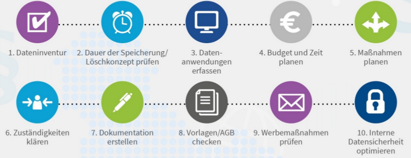

# DSGVO und digitale Transformation

## Lernziele

- Sie können selbständig entscheiden, ob für ein Schweizer
- Unternehmen die DSGVO anwendbar ist oder nicht.
- Sie kennen die notwendigen Schritte bei DSGVO-Projekten
- Sie verstehen die Faktoren für die exponentielle Entwicklung der "Digitalen Transformation“
- Sie kennen die Hype-Cycles
- Sie kennen Rechtsaspekte bei der Digitalisierung von Geschäftsprozessen

## Wann DSGVO? 
Die DSGVO ist seit Ende Mai 2018 auch für Schweizer Unternehmen direkt anwendbar, wenn:
- diese _Waren oder Dienstleistungen in der EU/EWR anbieten_ (die Angabe des Preises in Euro genügt) und __dazu personenbezogene Daten__ (z.B. Adressdaten, Kundenprofil) bearbeiten (Marktortprinzip: Art. 3 Abs. 2 DSGVO)
- diese das Verhalten von __Website-Besuchern aus der EU sammeln__ und auswerten (Tracking durch Cookies, Profiling mit Tools wie Google Analytics, Facebook Pixel etc.)
- diese regelmässig __Newsletter__ an Empfänger in der EU versendet
- diese im Auftrag oder als Konzernzentrale resp. -Mitglied eines in der EU domizilierten Unternehmens personenbezogene Daten bearbeiten

Das DSGVO ist nur ein Mindeststandard um ein eruopäisch vereinheitlichtes Datenschutzrecht zur Durchsetzung von merheitlich bereits bestehenden Grundsätzen. Die einzelnen Mitgliedsstaaten können weitergehende Regelungen erfassen.

## Rechte in der DSGVO
- __Auskunftsrecht__ und __Recht auf Datenübertragbarkeit__
- __Erweiterte Informationspflichten__ gegenüber der betroffenen Person
- __Widerspruchsrecht__
- __Recht auf Löschung__ (Recht auf Vergessen)
- Möglichkeit für __Abmahnungen__ und Klagen von __Genugtuung__ und __Schadenersatz__ für die betroffene Person
- __Privacy by design__ und __privacy by default__ (!)
- Erweiterte __Dokumentationspflichten__ (TOM’s, Verarbeitungsverzeichnisse, Beweislastumkehr)

### TOM's
Es muss dokumentiert werden, wie die informationstechnischen Gerätschafte aufgestellt sind und wer verantwortlich ist.

## Was ist zu tun?

__Grundlage jedes Datenschutz-Audits ist die Erhebung des aktuellen Zustandes__:  
Welche personenbezogenen Daten sind vorhanden? In welcher Form und wo? Zu welchem Zweck? Wer zeichnet sich verantwortlich? Wer hat Zugang? Wie lange werden diese gespeichert? Handelt es sich um besonders schützenswerte Personendaten? Wie werden diese technisch & organisatorisch geschützt? Wie wird das Risiko einer Verletzung & deren Folgen beurteilt?

