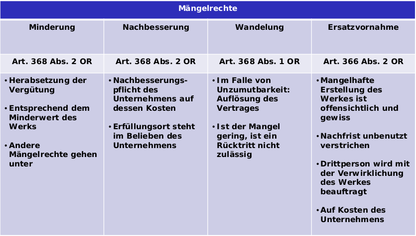

# Grundzüge der industrierelevanten Verträge

## Vertragstypen Übersicht

| Veräusserung  | Gebrauchsüberlassung  | Arbeitsleistung  | Übrige |
|---------------|-----------------------|------------------|--------|
|Kaufvertrag | AirBnB | Werkvertrag | Lizenzverträge |
| | Darlehen | Arbeitsvertrag |  |
| | Mietvertrag | Auftrag |  |

## Arbeitsvertrag

- Verrichtung von Arbeit nach Weisungen des Arbeitgebers
- Risiko liegt beim Arbeitgeber

## Werkvertrag

- Die Pflicht für einen Auftraggeber ein Werk zu erstellen (bspw. Software)
- Das Entscheidende bei einem Werkvetrag ist das Resultat -> Erfolgsverschulden

__Ersatzvornahme__:  
Wird ein Meilenstein während dem laufenden Werkvertrag nicht erreicht, muss zuerst eine angemessene Nachfrist vereinbart werden. Wird diese Nachfrist nach wie vor nicht genutzt und verstrichen, kann ein Dritt-Unternehmen zur Lösung des Problems angestellt werden und die Kosten müssen durch den Werkvertrag-Nehmer übernommen werden.

Drei Dinge, die bei einem Werkvertrag als erstes beachtet werden sollten:
- Zwischen wem ist der Vertrag?
- Welches Recht und welcher Gerichtsstand gilt?
- Wie komme ich wieder aus dem Vertrag raus? 

### Preisvereinbarung

- __Pauschalpreis__: Vertraglich fixierter Betrag als Höchst- und Mindestpreis
- __Globalpreis__: Festpreis (Teuerung angepasst)
- __Ausnahme__: Missverhältnis zwischen Leistung und Vergütung  
Keine Voraussehbarkeit der Umstände.

#### Fehlende Preisvereinbarung

- Wert der Arbeit und der Aufwendungen sind füride Vergütungsbemessung masgebend (z.B. unverbindlicher Kostenvoranschlag). Ein solcher Kostenvoranschlag hat eine gewisse Bedeutung
- zB «unverbindliche Kostenvoranschlag»
- Damit das Kostenrisiko nicht ganz auf den Besteller übergeht, hat die «__unverbindliche Kostenvoranschlag__» doch eine gewisse Bedeutung
- Achtung: Art. 375 Abs. 1 OR: Rücktrittsrecht des Bestellers, wenn «wesentlich» überschritten. (wesentlich = 10%)

### Pflichten des Unternehmners resp. Bestellers

__Pflichten des Unternehmers__
- Pflicht zur Herstellung eines Werks (Art. 363 OR)
- Materielles Werk: bewegliche oder unbewegliche Sache
- Geistiges Werk: wissenschaftliche oder künstlerische Leistungen
- Pflicht zur Lieferung des Werks (Art. 367 OR)
- Erfolg geschuldet: Resultat muss nach obj. Kriterien überprüft und als richtig oder falsch qualifiziert werden können
- keine besonderen Treuepflichten

__Pflichten des Bestellers__
- Pflicht zur Annahme und Abnahme des Werks (Art. 370 OR)
- Werkmangel: Vertragliche zugesicherte Eigenschaften fehlen
- Wertqualität: normale Beschaffenheit
- Gebrauchsqualität: normale Benutzung
- Prüfungspflicht innert nützlicher Frist, ansonsten Genehmigungsfiktion!
- Pflicht zur Leistung einer Vergütung (Art. 363 u. 372 OR)

## Auftrag

- Kein Erfolg garantiert
- Sorgfältige Ausführung

Der Auftrag muss persönlich ausgeführt werden. Andernfalls musst der Beauftragte den Auftraggeber informieren, falls die ausführende Person wechselt.

__Herausgabe__ bedeutet hier, dass der Arzt z.B. die Dossiers an einen neuen Arzt weitergibt oder Informationen zur Verfügung stellt.  
__Unzeit__ bedeutet, dass die Gegenseite nicht mehr disponieren kann.  
__Kündigen__ lässt sich ein Auftrag jederzeit von beiden Parteien, __unabhängig davon ob Kündigungsfristen im Auftrag stehen__ oder nicht.

## Vertragsabschluss

### Voraussetzungen

1. Rechts- und Handlungsfähigkeit der Vertragsparteien
42. Vorliegen beidseitigen Geschäftswillen
42. Austausch übereinstimmender Willenserklärungen
    Antrag:
    - Zeitlich erste Willenserklärung bei Vertragsverhandlung
    - Muss alle für den Vertrag massgebenden Punkte enthalten  
    Annahme:
    - Zeitlich zweite Willenserklärung bei der Vertragsverhandlung
    - Antragsempfänger erklärt Willen zum Vertragsabschluss durch die Annahme
    - Inhaltliche Übereinstimmung von Antrag und Annahme notwendig
42. Einhaltung von Formvorschriften, sofern erforderlich  
    Gewisse Verträge müssen z.b. schriftlich, öffentlich oder beurkundet werden.
42. Keine Verletzung inhaltlicher Schranken / keine Willensmängel (Art. 19/20ff. OR)

### Formvorschriften

Ein Mail entspricht nicht __einfacher Schriftlichkeit__.  
Ein Testament muss z.B. handschriftlich (Qualifizierte Schriftlichkeit) sein, sonst ist es form-nichtig.  
Eine Kündigung eines Mietverhältnisses durch den Vermieter muss mit einem offiziellen Formular gemacht werden (Qualifizierte Schriftlichkeit).

### Vertragserfüllung

- Bei der Vertragserfüllung werden die durch den Vertragsabschluss begründeten Obligationen (Verpflichtungen) erfüllt.
- Das Internet ist ein neues Kommunikationsmedium, das heute vermehrt dazu benutzt, übereinstimmende Willensäusserungen auszutauschen, die zu Vertragsabschlüssen führen (Art. 1 OR).
- Fragen des Vertragsabschlusses und der Vertragserfüllung regeln sich – genau wie beim mündlichen Vertragsabschluss oder beim brieflichen Austausch von Willenserklärungen – nach den allgemeinen Bestimmungen des Obligationenrechts.

### Vertragsverletzungen

__Knonentionalstrafe:__ Ist unabhängig ob wirklich ein Schaden entstanden ist oder nicht. Zudem kann zusätzlich die Vertragserfüllung trotzdem verlangt werden.

## AGB
AGB sind __vorformulierte__ Vertragsbestimmungen, die als Grundlage für eine Vielzahl von Verträgen verwendet werden, die der Verfasser mit seinen Kunden schliesst.

Ziele von AGB:
- __Rationalisierungszweck__
- Besserstellungszweck:
    - Freizeichnungs-Klauseln
    - Sicherheiten-Klauseln
    - Risikoverlagerungen
- Verhandlungsvorgabe

### Einbezug
Für das Zustandekommen eines Vertrages (Konsens) bedarf es der übereinstimmenden gegenseitigen Willenserklärungen beider Parteien. Dies gilt auch für die Einbeziehung der AGB in den Individualvertrag

__Voraussetzungen der AGB-Einbeziehung__
- AGB-Kundbarmachung: Kunde __ist vor oder während__ der Vertragsverhandlungen auf die AGB hinzuweisen
- AGB-__Kenntnisnahme__: Kunde muss spätestens vor Vertragsschluss Gelegenheit zur Kenntnisnahme haben Achtung: Nachgeschobene AGB sind ungültig
- AGB-Geltung: Kunde muss mit der AGB-Geltung einverstanden sein

### Typologisierung

__Globalakzept__: Bedeutet, dass viele leute einfach ohne zu lesen die AGB akzeptieren. Dann gibt es die beiden folgenden Regeln zu beachten.

__Vollakzept__: Bedeutet, wenn man bemerkt hat dass der Konsument die AGB voll gelesen und akzeptiert hat.

__Ungewöhnlichkeits- und Unklarheitsregel__:  
Verwendung missbräuchlicher Geschäftsbedingungen (Art. 8 UWG) „Unlauter handelt insbesondere, wer allgemeine Geschäftsbedingungen verwendet, die in __Treu und Glauben__ verletzender Weise zum Nachteil der Konsumentinnen und __Konsumenten__ ein erhebliches und ungerechtfertigtes __Missverhältnis__ zwischen den vertraglichen __Rechten und Pflichten__ vorsehen.“  

__Ungewöhnlichkeitsregel__: Enthalten AGB Bestimmungen, mit denen der Kunde (nach Treu und Glauben) nicht rechnen muss, so sind diese Bestimmungen für den Kunden nicht verbindlich  
*z.B. in einem Ski-Hüttchen der Gerichtsstand in Floria*  

__Unklarheitsregel__: Finden sich in den AGB Regelungen, die unklar sind, so
werden diese zu Lasten des Verfassers der AGB ausgelegt  
*Wenn der Leser etwas der AGBs nicht versteht (oder verstehen kann), werden diese Teile zu Lasten des Verfassers ausgelegt.*

## SIA-Verträge
- Vertragsformulare der SIA für Geschäftsbeziehungen zwischen
    - __Bauherren und Planern__ (Aufträge) sowie zwischen
        - BSP: Vertrag für Ingenieurleistungen Nr. 1003
    - __Bauherren und Unternehmern__ (Werkverträge)
        - BSP: Werkvertrag Nr. 1023
- Sicherstellung der __korrekten Einbindung__ der entsprechenden Vertragsnorm
- __Breit abgestützte Grundlage__ für die Geschäftsbeziehung
- Schweizweit anerkannt und für __80% der Fälle als Standard anwendbar__
- Knappe und __klare Struktur__ / detaillierte Aspekte mithilfe von Beilagen

## SWICO-Verträge
- IT-Modellverträge, welche durch Anwälte der Verbände SWICO und SwissICT erarbeitet werden
- Faire und ausgewogene Regelungen
- Konkrete Bezugnahme auf IT-relevante Vertragsgestaltungen
- Nur Geltung, wenn konkret im Vertrag vereinbart

Vorteile Swico-Verträge:
1. Branchenbezogenheit
2. Fachgerechte Formulierung

# Übungen
*Übung: G. Grundzüge der in der Industrie relevanten Verträge*

__Die Parteien möchten nun eruieren, was sie genau abgemacht haben. Erklären Sie den Parteien, wie ein Vertrag grundsätzlich zu Stande kommt und wie sie herausfinden können, was tatsächlich abgemacht wurde__
Es braucht
- eine gegenseitige übereinstimmende Willenserklärung (Art. 1 OR)
- ein wirklicher Wille (Art. 18 OR)
- Durch Auslegungsmethoden werden die verwendeten Formulierungen gedeutet und es entsteht ein mögliches Abbild der dem Vertrag zugrunde liegenden Absichten

__Die Soft AG vertritt die Meinung, ihre AGBs seien ohnehin immer anwendbar. Wie sieht die Situation diesbezüglich aus? Beraten Sie die Soft AG__
- Die AGB gelten nur, wenn sie für das konkrete Verhältnis zum Vertragsbestandteil erklärt wurden.
- Nur das, was im Rahmen dieser übereinstimmenden Willensäusserung vereinbart wurde gilt.
- In der Regel lesen Konsumenten AGB nicht durch, sondern akzeptieren sie einfach. Mit diesem Globalakzept werden die AGB zum Vertragsbestandteil. 

__Erläutern Sie der Soft AG auch, was der Unterschied ist zwischen der Anwendbarkeit von Unternehmer- und Kunden-AGB__  
Es wird unterschieden zwischen B2B und Konsumenten AGBs. Für Konsumenten gelten zusätzliche Regeln bzw. es sind bessere Schutzmechanismen verfügbar.

__Im vorliegenden Fall handelt es sich um einen Vertrag auf Arbeitsleistung. Erläutern Sie, um welchen Vertrag auf Arbeitsleistung es geht und warum.__  
Um einen Werkvertrag.

Der Unternehmer verpflichtet sich zur Herstellung eines Werkes und der Besteller zur Leistung einer Vergütung.

__Welche anderen Verträge auf Arbeitsleistungen gibt es noch und welche sind die wesentlichen Unterscheidungskriterien?__  
- Werkvertrag 
- Arbeitsvertrag
- Auftrag

__Die Handels AG  stellt sich auf den Standpunkt, es sei ja egal im Detail was abgemacht wurde, auf diese Vertragsverhältnisse würden ja ohnehin jeweils die Swico-Verträge angewandt. Bitte erläutern Sie, um was es sich bei den Swico-Verträgen handelt und beraten Sie die Handels AG.__  
Diese Verträge gelten nicht einfach per se. Die Verträge müssen explizit in den Verträgen erwähnt werden.

__Die Soft AG hingegen vertritt die Meinung, in der Industrie kämen immer die SIA-Verträge zur Anwendung. Bitte erläutern Sie, um was es sich bei den SIA-Verträgen handelt und beraten Sie die Soft AG.__  
Die SIA Verträge sind nationale Regeln der Baukunde. Diese Verträge sind für architektonische Werke, aber nicht für IT-Projekte.

__Auf welche Punkte muss man beim Vertragsabschluss resp. bei Standardverträgen insbesondere achten und warum? Bitte beraten Sie die Parteien und begründen Sie Ihre Antwort.__  
- Wie kann ich aussteigen? (etwas ausscheiden)
- Was ist der Gerichtsstand?
- Das anwendbare Recht?
- Kündigungsfristen
- Parteien
- Duedilligence
- Vertragszweck
