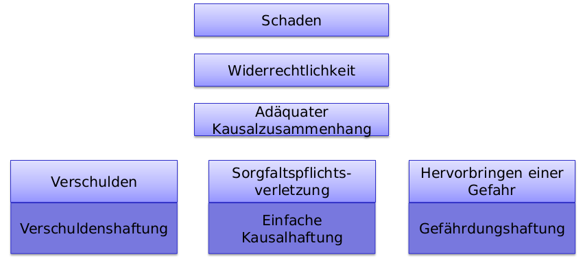

# Haftpflichtrecht

## Formen

__Verschuldungshaftung:__ Schädiger haftet grundsätzlich nur, wenn er den Eintritt des Schadens verschuldet hat (Persönliche Vorwerfbarkeit)

__Kausalhaftung:__  Setzt kein Verschulden voraus, sondern ist gegeben, wenn durch das Gesetz festgelegte Tatbestandsvoraussetzungen erfüllt sind.

- einfache Kausalhaftung
- Geschäftsherrenhaftung (Art. 55 OR) - Chef haftet für Mitarbeiter
- Werkeigentümerhaftung (Art. 58 OR) - Haft für Werke (Baugerüste, Häuser, ...)
- Haftung des Grundeigentümers (Art. 679 ZGB)
- Produktehaftpflicht (PrHG)
- Gefährdungshaftung: Bestimmten Einrichtungen sind Gefahren inhärent, die den Betreibern dieser Einrichtungen eine besondere Verantwortung aufbürden (Gefahrensatz).

## Voraussetzungen

 - Schaden
 - Widerrechtlichkeit
 - Adäquater Kausalzusammenhang
 - Verschulden
 

### Definition Schaden
Unfreiwillige Verminderung des Vermögens in Form:
- Abnahme der Aktiven
- Zunahme der Passiven
- Entgangener Gewinn

*Der Schaden als Vermögenseinbusse bestimmt sich grundsätzlich nach der Differenz zwischen dem gegenwärtigen Vermögensstand und dem Stand, den das Vermögen ohne das schädigende Ereignis hätte.*

### Schadensformen

- Vermögensschaden
    - Definition von vorher: Schaden als Vermögenseinbusse
- Personenschaden
    - Beeinträchtigung der Gesundheit einer Person
- Sachschaden
    - Wenn eine Sache Schaden nimmt, wie z.B. ein Laptop
- Immaterieller Schaden
    - Reputation
    - Persönlichkeitsverletzung
- Direkter Schaden
    - Der Schaden ist durch das schädige Ereignis direkt ausgelöst
- Indirekter Schaden
    - Der Schaden ensteht später als das schädigende Ereignis

### Wiederrechtlichkeit
- Es muss entweder ein absolutes Recht verletzt sein
    - Absolute Rechte sind Rechte, die gegenüber allen gelten
        - Besitz / Eigentum
        - Leben
        - Ehre
        - Gesundheit
- Oder es muss eine Schutznom verletzt werden
    - Veruntreuung oder Datenbeschädigung

__Datenbeschädigung__
Wer unbefugt elektronisch oder in vergleichbarer Weise gespeicherte oder übermittelte Daten verändert, löscht oder unbrauchbar macht, wird, auf Antrag, mit Freiheitsstrafe bis zu drei Jahren oder Geldstrafe bestraft.

### Widerrechtlichkeit - Rechtfertigungsgründe

- Notwehr (Art. 52.1 OR) - Verhältnissmässige Abwehr in einer Notsituation
- Notstand (Art. 52.2 OR) - Um sich selber zu schützen, greift man in das Rechtsgut eines anderen ein.
- Selbsthilfe (Art. 52.3 OR) - Die eigene Sache darf wieder veschaft werden (ohne Selbstjustiz)
- Einwilligung des Verletzten - z.B. eine Operation
- Amtspflicht - z.B. Taschenkontrolle durch einen Polizisten

### Adäquater Kausalzusammenhang

- Wenn eine Ursache geeignet ist, eine Wirkung zu erbringen.

### Verschuldungsformen

- __Vorsatz__: Der Schuldner strebt einen Erfolg bewusst an.
- __Eventualvorsatz__: Der Schädiger nimmt ein Schaden in Kauf.
- __Fahrlässigkeit__: Nicht absichtlich angestrebte _mangelhafte Sorgfalt_ führt zur Verletzung.
     - __Grobe Fahrlässigkeit__: Die gebotene Sorgfaltspflicht ist in besonders schwerer Weise verletzt.
    - __Leichte Fahrlässigkeit__: Das Verhalten des Schädigers kann als "einigermassen verständlich" bezeichnet werden. z.B. wenn man aus Versehen jemand mit einer Dampfwalze überfährt

