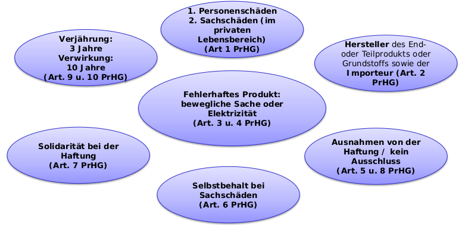
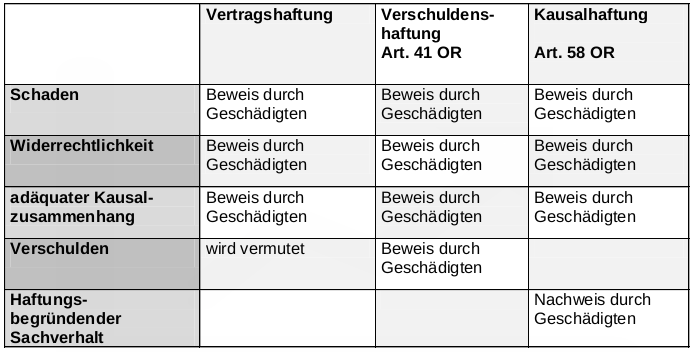

# Grundzüge des Haftpflichtrechtes gemäss OR und Spezialgesetzen

## Werkeigentümerhaftpflicht

Ihrem Unternehmen gehört eine Lokalität im Herzen der Altstadt von Liestal.
Herr X, interessiert sich für Ihre Produkte, die er im Schaufenster sieht und
möchte Ihren Laden betreten. Er rutscht auf dem Eis vor der Ausgangstüre
aus und verletzt sich am Knöchel. Liegt hier ein Fall der
Werkeigentümerhaftpflicht vor? (Art. 58 OR)

- Schaden - Der Knöchel ging defekt, der Arzt kostet
- Verschulden - Mangelhafte Unterhaltung des Werkes
- Wiederrechtlichkeit - Unbetrittenes Recht für Gesundheit wurde verletzt
- Werk: Alles, was künstlich hergestellt und mit dem Boden verbunden ist
- Vorliegen eines Werkmangels: Werk bietet bei bestimmungsgemässen Gebrauch keine genügende Sicherheit
- Kausalzusammenhang
- Mangelnder Unterhalt
- BGer: "Wer den Besuchern eines Verkaufslokals eine Ausgangstüre zur Verfügung stellt, hat für deren möglichst gefahrlose Benützbarkeit zu sorgen. Dazu gehört auch, dass er unmittelbar jenseits der Türe laufende Gefahren, wie Glatteis auf dem Trottoir, im Rahmen des Möglichen und Zumutbaren beseitigt oder zumindest mit einem Warnschild (Achtung gschliferig) darauf aufmerksam macht."

## Produktehaftpflichtgesetz

- Der Schaden an Personen ist gedeckt
- Private Sachschäden sind auch gedeckt. Werden jedoch Dinge von einem Unternehmen beschädigt, ist dies nicht gedeckt.
- Produkthaftpflicht darf nicht durch AGBs oder andere Verträge ausgeschlossen werden
- Solidarität bei der Haftung heisst: Auch wenn man als Importeur z.B. nichts für das Versagen des Produkts hat, haftet man und muss zahlen.
- Die Produktehaftpflicht gilt nur 10 Jahre nach Einführung des Produkts und 3 Jahre nach Eintritt eines Schadens

## Gefährdungshaftung

Die Gefährdungshaftung ist eine qualifizierte Kausalhaftung, indem sie davon ausgeht, dass bestimmten Einrichtungen Gefahren inhärent sind, die den Betreibern dieser Einrichtungen eine besondere Verantwortung aufbürden.  
BSP: Haftpflicht des Motorfahrzeughalters (SVG)

Art. 58.1 SVG

- Wird durch den Betrieb eines Motorfahrzeuges ein Mensch getötet oder verletzt oder Sachschaden verursacht, so haftet der Halter für den Schaden.

## Voraussetzungen Haftpflichtrecht

## Culpa in contrahendo

Ist im Gesetz nirgends geregelt.

„Verschulden bei Vertragsverhandlung“
Voraussetzungen:

- es werden Verhandlungen über einen zukünftigen Vertrag geführt,
- vorvertragliche Pflichten werden verletzt,
- eine der Vertragsparteien erleidet einen Schaden, welcher
- adäquat-kausal aus der Pflichtverletzung hervorgeht
- und dem Verschulden der schädigenden Person zuzuschreiben ist.

